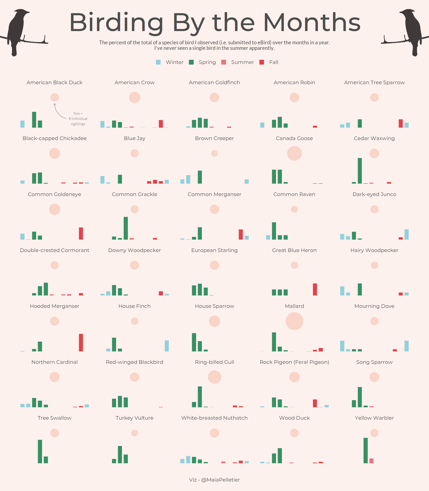

```{r setup, include=FALSE}
knitr::opts_chunk$set(echo = TRUE, fig.align = "center")
```

My contributions to the [30 day chart challenge](https://github.com/Z3tt/30DayChartChallenge_2021).  

### Day 1: Part to Whole    
  

### Day 2: Pictogram   


### Day 3: Historical (Done by hand)   


### Day 4: Magical    
  

### Day 5: Slope   
  

### Day 6: Experimental   
  

### Day 7: Physical   
  


### Day 8: Animals   
  


### Day 11: Strips   
 


